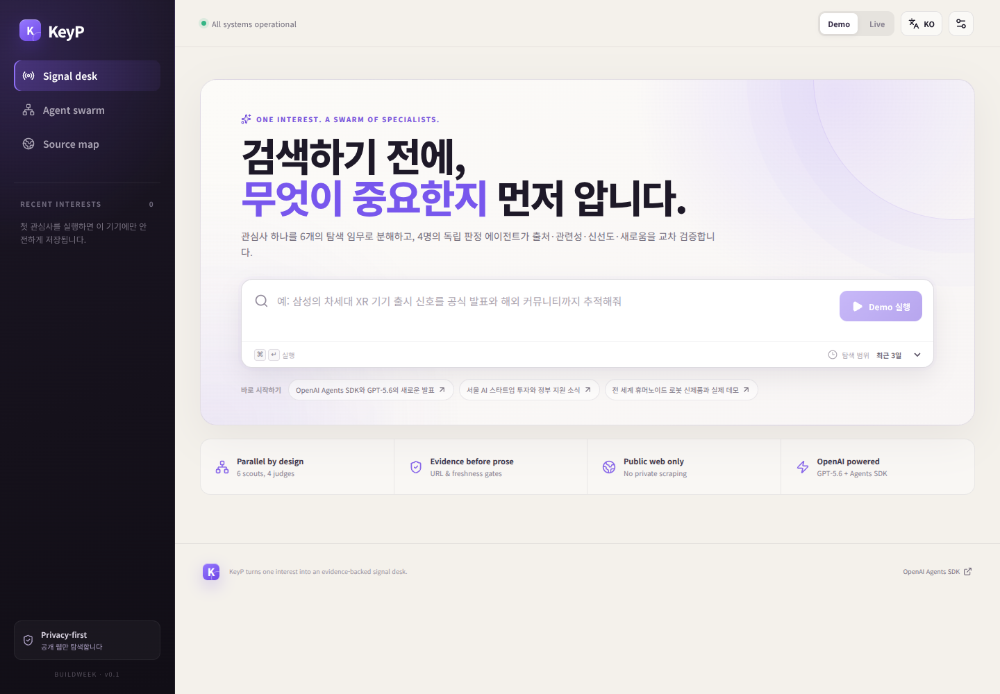
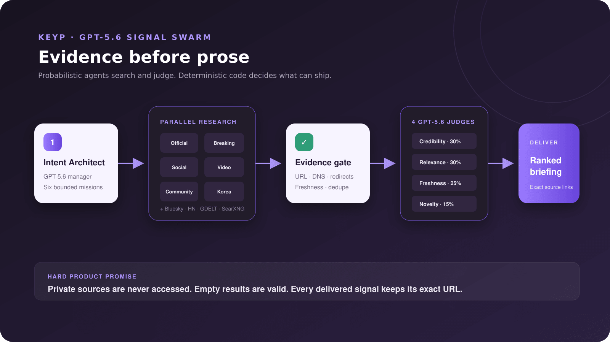

# KeyP — the signal, not the noise

KeyP turns one natural-language interest into a verified, multilingual signal desk. A GPT-5.6 manager creates six bounded search missions; six scouts search in parallel; deterministic evidence gates reject unsafe, stale, or duplicate URLs; four independent judges score credibility, relevance, freshness, and novelty; and a final editor prepares a source-preserving briefing.

> OpenAI Build Week 2026 · **Apps for Your Life** · standalone web rebuild in `apps/keyp-web`



## Try it

Requirements: Node.js 22+ and pnpm 11.

```bash
corepack pnpm install --frozen-lockfile
corepack pnpm dev:web
```

Open `http://localhost:4173`. **Demo** mode is selected by default and works without an API key or external services.

For Live mode, create `.env.local` at the repository root:

```dotenv
OPENAI_API_KEY=your_server_side_key
KEYP_MODEL=gpt-5.6
```

Never use a `VITE_` prefix for the API key. The browser calls KeyP's server; only the server calls OpenAI.

Production:

```bash
corepack pnpm build:web
corepack pnpm start:web
```

## What is new for Build Week

KeyP existed before the submission period as an Expo/React Native app with an Express backend. The auditable Build Week extension is the standalone `apps/keyp-web` application built after July 13, 2026:

- a new responsive React web experience with no Expo, Clerk, or Replit AI dependency;
- OpenAI Agents SDK orchestration with `gpt-5.6` throughout the manager, scouts, judges, and editor;
- six concurrent public-web research lanes: official, breaking, social, video, community, and Korea;
- concurrent Bluesky, Hacker News, GDELT, and optional SearXNG adapters;
- strict URL protocol/DNS/redirect/status checks, semantic deduplication, event-time freshness, and deterministic weighted fusion;
- a no-cost Demo mode, local interest history, server-only secrets, and Live rate limiting;
- deterministic tests, production builds, and Chromium verification at desktop and mobile widths.

The pre-event implementation remains under `artifacts/` for history. It is not required to run the new web app.

## Architecture



The system deliberately separates probabilistic research from deterministic acceptance:

1. **Intent Architect** — GPT-5.6 turns an interest into exactly six narrow tasks.
2. **Parallel research** — six hosted web-search scouts plus public adapters collect candidates concurrently.
3. **Evidence gate** — code rejects private-network URLs, unreachable pages, old events, known URLs, and semantic duplicates.
4. **Independent judges** — four GPT-5.6 agents score one dimension each.
5. **Deterministic fusion** — `30% credibility + 30% relevance + 25% freshness + 15% novelty`, with hard relevance/novelty/freshness failures.
6. **Briefing Editor** — GPT-5.6 writes Korean or English copy without changing candidate IDs or source URLs.

Empty results are valid. KeyP prefers silence to a fabricated or unverifiable alert.

## How Codex accelerated the build

Codex was the primary implementation partner for the Build Week extension. The collaboration began with a product decision: isolate the hackathon experience from the pre-existing Expo/Replit stack after that stack produced dependency and post-login blank-screen failures. Codex then:

- inspected the legacy boundaries and created the separate `keyp-web-rebuild` branch;
- translated the product idea into typed contracts and an auditable 12-agent topology;
- implemented the React interface, Express server, Agents SDK workflow, public adapters, URL safety gates, tests, and deployment docs;
- ran typechecks, deterministic tests, production API checks, and real Chromium verification;
- used a paid Live smoke test to catch an actual Structured Outputs incompatibility (`format: uri`), then moved URL enforcement to the deterministic evidence gate and verified all GPT-5.6 scouts completed successfully.

The human product decisions remained explicit: preserve the KeyP name and privacy promise, choose **Apps for Your Life**, prioritize evidence over volume, avoid brittle private-platform scraping, make Demo mode the default, and rebuild as a portable web product rather than keep patching the Expo shell.

GPT-5.6 is not a label on the UI. It performs intent decomposition, live web research, four-dimensional independent judging, and multilingual source-preserving editing in the running product.

## Safety and privacy

- Public information only; no login bypass, private-account access, friend graphs, or deanonymization.
- Every model-proposed URL passes an SSRF-resistant DNS and redirect gate before delivery.
- Live mode is limited per client; Demo mode never calls a paid model.
- Browser history stays in local storage; the MVP does not create user profiles.
- Secrets are loaded only from server environment variables and `.env.local` is ignored by Git.
- X, Facebook, Instagram, TikTok, YouTube, Reddit, and Naver coverage means public, web-visible content—not universal or private API access.

## Verification

```bash
corepack pnpm typecheck:web
corepack pnpm test:web
corepack pnpm build:web
```

Current evidence:

- 6/6 deterministic tests pass;
- TypeScript passes with no emit;
- production client and server bundles build successfully;
- Demo API returns 6 lanes, 12 agent nodes, 3 signals, and deterministic metrics;
- Chromium renders desktop and 390 px mobile without blank pages, error overlays, console errors, or horizontal overflow;
- Live GPT-5.6 smoke test produced 13 candidates with zero failed agents. This restricted Codex sandbox could not complete public URL DNS verification, so the final Live URL-gate check must be repeated on the deployed host.

## Documentation

- [Standalone web app guide](apps/keyp-web/README.md)
- [Architecture](apps/keyp-web/docs/ARCHITECTURE.md)
- [Open-source components and decisions](apps/keyp-web/docs/OPEN_SOURCE.md)
- [Replit and Node deployment](apps/keyp-web/docs/DEPLOYMENT.md)
- [Devpost submission checklist](apps/keyp-web/docs/DEVPOST_CHECKLIST.md)
- [Under-three-minute video script](apps/keyp-web/docs/VIDEO_SCRIPT.md)

## License

MIT. Third-party components retain their own licenses and terms; see [OPEN_SOURCE.md](apps/keyp-web/docs/OPEN_SOURCE.md).
