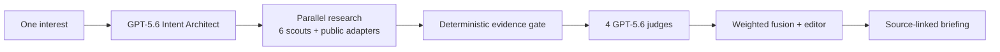

# Architecture

## Execution topology



The manager must produce one task for every lane: `official`, `breaking`, `social`, `video`, `community`, and `korea`. `Promise.all` makes the six hosted web-search scouts and native public adapters concurrent.

The evidence gate executes before judging:

- canonicalize URLs and remove tracking parameters;
- reject known URLs and semantic duplicates;
- reject events outside the requested freshness window;
- resolve DNS and reject loopback, link-local, private, and reserved addresses;
- follow at most three redirects while rechecking every target;
- reject missing, gone, or server-error pages.

Four judges then score only one dimension each. Code—not another model—combines the results:

```text
confidence = credibility × 0.30
           + relevance   × 0.30
           + freshness   × 0.25
           + novelty     × 0.15
```

Any explicit judge exclusion, relevance below 40, novelty below 40, or stale event is a hard rejection. The editor can rewrite titles and summaries but cannot change IDs or source URLs.

## Failure behavior

- Planner failure → deterministic six-lane plan.
- One scout failure → other scouts continue.
- Public adapter failure → non-blocking partial event.
- Missing judge item → deterministic dimension fallback.
- Zero verified candidates → judges and editor are skipped; the UI explains that silence is intentional.
- Missing API key → Live returns an actionable server error; Demo remains available.

## Privacy boundary

The browser sends interests to the same-origin server. API keys never enter client bundles. KeyP does not authenticate to social accounts, enumerate private identities, or bypass platform controls. Browser history is stored locally for the MVP.
