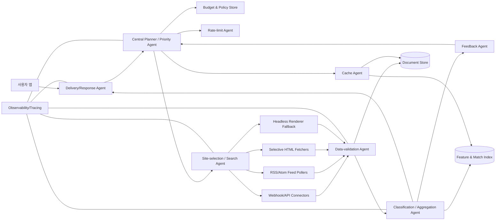
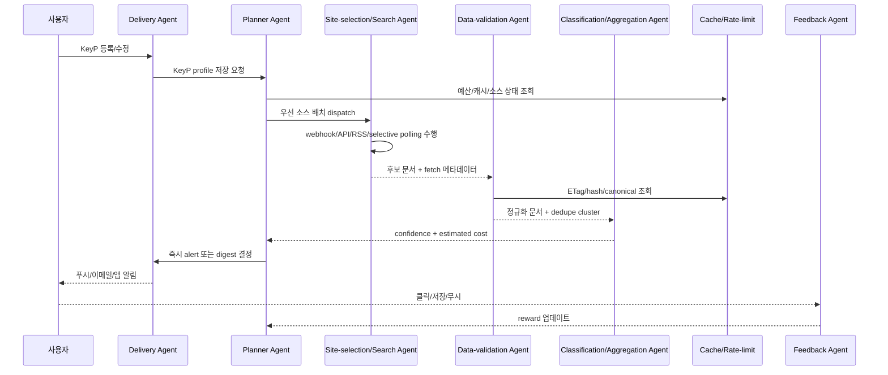
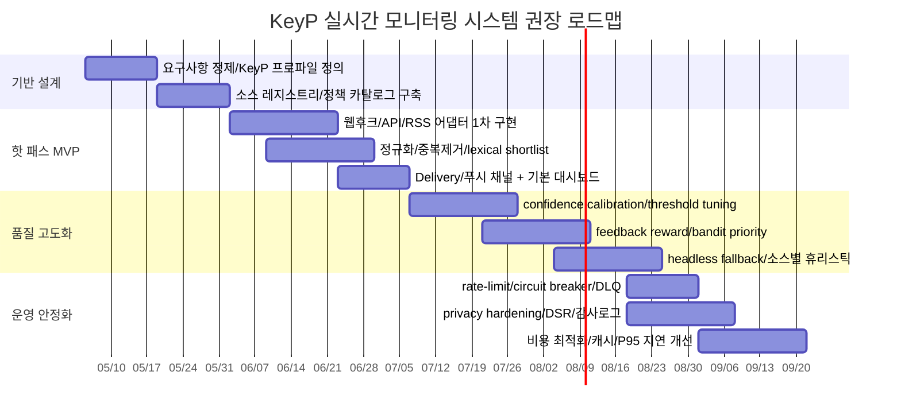

# 실시간 KeyP 매칭용 자원효율형 멀티에이전트 시스템 설계 보고서

## 경영진 요약

이 보고서의 핵심 결론은, KeyP 모니터링 시스템을 **“중앙 플래너가 예산과 우선순위를 통제하고, 소스별 전문 에이전트가 수집하며, 검증·중복제거·분류는 공용 서비스로 묶는 하이브리드 하네스 구조”**로 설계하는 것이 가장 비용 대비 성능이 높다는 점이다. 웹후크는 폴링 대신 이벤트 발생 시 데이터를 서버로 전달하므로 지연 측면에서 가장 유리하고, focused crawling 계열 연구는 관련 영역만 선별적으로 추적할 때 네트워크·하드웨어 자원을 절약하면서도 최신성을 높일 수 있음을 보여준다. 따라서 “모든 후보를 LLM으로 탐색·요약”하는 구조보다, **검색과 후보 축소는 규칙·통계·캐시가 담당하고 LLM은 애매한 소수 후보의 판정과 설명에만 쓰는 구조**가 바람직하다. citeturn1search11turn20view2turn20view0

“실시간”을 이 보고서에서는 **가능하면 end-to-end 10초 이하**로 해석한다. 다만 이 목표는 모든 소스에서 동일하게 달성되지는 않는다. 웹후크·1차 API·자체 피드가 있는 소스는 수 초 내 경로를 설계할 수 있지만, RSS/사이트맵은 “주기 재방문” 기반이며, 검색엔진의 수집요청은 공식 문서상 최소 1일~수주가 걸릴 수 있고 검색결과 노출도 보장되지 않는다. 즉 **실시간 경로와 백필(backfill) 경로를 분리**해야 한다. citeturn2search1turn2search11turn2search5turn1search11

비용 구조는 생각보다 단순하다. 대개 총비용의 대부분은 “수집 요청 수”와 “후보당 LLM 사용량”에서 결정된다. 예시 단가로 보면, cached input이 일반 input보다 10배 저렴한 LLM 가격표가 이미 존재하고, 서버리스 컨테이너도 동시성을 높이면 같은 월 1,000만 요청 워크로드에서 비용이 크게 줄어든다. 따라서 **조건부 요청(ETag/If-None-Match, Last-Modified/If-Modified-Since), 로컬 사전 필터링, 프롬프트 캐싱, 동시성 높은 서버리스 실행, 상위 소수 후보만 고급 모델 호출**이 비용 최소화의 주축이 된다. citeturn13search0turn22view0turn14search0turn14search1turn14search2turn14search12

## 설계 기준과 대안 비교

이 시스템의 목적함수는 하나가 아니라 네 개다. **정확도(오탐/누락 최소화)**, **최신성(가능하면 10초 이내)**, **비용(토큰·API·네트워크 절감)**, **운영 안정성(소스 장애·429·중복 폭주·웹후크 유실 내성)**을 동시에 만족해야 한다. focused crawling 연구와 최신성 최적화 연구는 “모든 페이지를 동일 빈도로 훑는 전략”보다 **관련성(relevance)과 변화율(change rate)에 따라 재방문 빈도를 다르게 배분하는 정책**이 합리적임을 보여준다. citeturn20view2turn20view0

아래 비교표는 공개 문서가 보여주는 사실들—웹후크의 즉시성, RSS/사이트맵의 주기 재방문, 조건부 요청의 대역폭 절감, 서버리스 동시성의 비용 차이—를 바탕으로 한 설계적 종합판단이다. 권고안은 **“이벤트 기반 + 선택적 폴링 + 중앙 예산 통제 + 계층형 매칭”**이다. citeturn1search11turn2search1turn14search0turn22view0

| 설계안 | 구조 | 장점 | 약점 | 토큰/API 비용 | 실시간 적합성 | 최종 판단 |
|---|---|---|---|---:|---|---|
| 단일 모놀리식 폴러 | 크론 + 크롤러 + 즉시 알림 | 구현이 단순 | 소스별 전략 분화가 어려움, 중복·예산 통제가 취약 | 높음 | 낮음 | PoC용까지만 권장 |
| 완전 에이전트형 매 호출 플래닝 | 모든 이벤트마다 LLM 플래너 호출 | 유연성 높음 | 계획 비용 자체가 큼, 지연 변동 큼 | 매우 높음 | 보통 | 비권장 |
| 이벤트 기반 단일 파이프라인 | 웹후크/API 중심, 폴링 최소 | 지연이 낮음 | 웹후크 없는 웹 전반 커버가 약함 | 낮음 | 높음 | 특정 소스군에 적합 |
| 하이브리드 하네스 | 중앙 플래너 + 소스별 전문 에이전트 + 공용 검증/분류 서비스 | 비용·정확도·운영성 균형이 가장 좋음 | 초기 설계가 더 정교해야 함 | 중간 이하 | 높음 | **권장** |

KeyP는 “문자열 키워드”가 아니라 **키워드 세트 + 동의어 + 제외어 + 언어/지역 + 소스 범위 + 긴급도 + 사용자 행동 피드백**으로 정의하는 편이 낫다. 이렇게 해야 플래너가 “어느 소스에 얼마의 예산을 배분할지”를 결정할 수 있고, 동일 키워드라도 사용자 맥락에 따라 소스 우선순위가 달라진다. 이 보고서에서는 KeyP를 이런 **프로파일형 단위**로 전제한다. citeturn20view0turn9search13

## 권장 전체 아키텍처

권장 아키텍처는 **핫 패스(hot path)**와 **콜드 패스(cold path)**를 철저히 분리한다. 핫 패스는 “웹후크·API·RSS·경량 폴링 → 정규화 → 중복제거 → 저비용 분류 → 즉시 푸시”만 수행한다. 콜드 패스는 “백필, 장문 요약, 히스토리 재색인, 피드백 학습, 비용 최적화, 품질 리포트”를 비동기로 처리한다. focused crawler 논문은 분산된 특화 크롤러 팀이 낮은 자원으로도 특정 주제의 최신성을 높일 수 있음을 보였고, 최신성 연구는 페이지 변화율 온라인 추정이 재방문 정책의 핵심임을 보여준다. citeturn20view2turn20view0



이 구조의 포인트는 중앙 플래너가 모든 의사결정을 직접 “생성”하는 것이 아니라, **예산·정책·성능 메트릭을 바탕으로 서브에이전트를 배선(harness)하는 제어평면**이라는 점이다. 그 아래의 수집·검증·분류 에이전트는 가능한 한 결정론적이고 측정 가능해야 한다. 분산 시스템 전체 경로는 트레이스로 연결해 요청당 지연·중복·재시도·토큰 사용량을 한 눈에 보이게 해야 한다. OpenTelemetry 문서는 트레이스가 분산 서비스에서 요청 경로 전체를 이해하는 핵심 신호라고 설명하며, Collector는 속성 보강과 개인정보 스크러빙도 지원한다. citeturn18search3turn18search19

## 에이전트 역할과 상호작용

다음 표는 필수 에이전트와 선택 에이전트의 책임을 정리한 것이다. 기본 원칙은 **에이전트는 역할이 좁고, 상태는 중앙 저장소에 두며, 메시지는 멱등적(idempotent)이어야 한다**는 것이다. 웹후크 재전달, 429 재시도, 중복 문서 병합을 안정적으로 처리하려면 이 원칙이 중요하다. citeturn11search2turn11search14turn11search0turn18search3

| 에이전트 | 핵심 책임 | 입력 | 출력 | 핫패스 여부 |
|---|---|---|---|---|
| Central Planner / Priority Agent | 소스 우선순위 계산, 예산 배분, hot/cold path 분기 | KeyP, 소스 메타데이터, 예산 상태, 피드백 | dispatch plan, token/API budget, escalation 정책 | 예 |
| Site-selection / Search Agent | 웹후크 수신, API 조회, RSS/Atom 폴링, HTML fetch, 렌더링 fallback | dispatch plan | 원시 후보 문서, fetch 메타데이터 | 예 |
| Data-validation Agent | URL 정규화, canonical 추출, ETag/Last-Modified 검사, 스키마 검증, robots/policy 체크 | 원시 후보 문서 | 정규화 문서, 중복 후보군, 검증 flags | 예 |
| Classification / Aggregation Agent | 키워드 일치 판정, 스코어링, 클러스터링, 최종 confidence 계산 | 정규화 문서, KeyP profile | match object, evidence bundle, confidence | 예 |
| Delivery / Response Agent | alert/digest 결정, 사용자 채널 전송, 설명 생성 | confidence 결과, 사용자 선호 | 푸시/이메일/앱내 알림 | 예 |
| Cache Agent | L0/L1/L2 캐시, 콘텐츠 fingerprint, prompt prefix cache | 문서/응답/프롬프트 prefix | 캐시 히트, TTL 갱신 | 선택 |
| Rate-limit Agent | per-source 토큰 버킷, concurrency gate, Retry-After 처리 | 응답 헤더, rate-limit 상태 | backoff, refill schedule | 선택 |
| Feedback Agent | 클릭, 저장, 무시, false positive, missed hit 기록 | 사용자 행동 로그 | bandit reward, 재학습 feature | 선택 |

핫 패스의 표준 상호작용은 아래와 같다. 설계상 중요한 점은 **검색(search)**과 **판정(classification)**을 분리하고, 판정 이전에 **캐시·정규화·중복제거**를 넣어 LLM 호출 비율을 최대한 낮추는 것이다. citeturn14search0turn14search2turn19search0turn8search0turn8search1



샘플 메시지 흐름은 다음과 같이 정의하면 된다. 이 표의 수치는 외부 서비스의 SLA가 아니라 **시스템 내부 SLO 목표**다. 핫 패스는 합산 10초 이내를 목표로 하되, headless 렌더링이나 느린 외부 API가 필요한 경우 즉시 alert 대신 “예비 탐지”로 먼저 보내고 상세 설명은 비동기 보강으로 뒤따르게 하는 것이 안전하다. citeturn1search11turn22view0turn18search3

| 단계 | 발신자 → 수신자 | 핵심 필드 | 지연 목표 | 토큰 목표 |
|---|---|---|---:|---:|
| KeyP 등록 | 앱 → Delivery | user_id, keyword_set, negative_terms, scope | 100ms | 0 |
| 계획 수립 | Delivery → Planner | KeyP profile, tenant budget, source stats | 50ms | 0~50 |
| 수집 실행 | Planner → Search | source_batch, request_budget, freshness target | 0.5~3s | 0 |
| 검증/정규화 | Search → Validation | raw_doc, url, headers, fetched_at | 50~300ms | 0 |
| 1차 판정 | Validation → Classification | normalized_text, lexical hits, source features | 100~800ms | 0~800 |
| 전달 결정 | Classification → Delivery | confidence, evidence, dedupe cluster | 50~200ms | 0~200 |
| 피드백 반영 | 앱 → Feedback → Planner | click/ignore/save/report | 비동기 | 0 |

## 소스 우선순위와 수집 알고리즘

소스 우선순위는 **접근 방식별 계층**과 **소스별 특징량** 두 층으로 계산하는 것이 좋다. 기본 계층 우선순위는 보통 **웹후크 > 1차 API > RSS/Atom > sitemap lastmod + conditional GET > 일반 HTML fetch > headless render** 순서다. 웹후크는 폴링보다 즉시성이 높고, 이벤트를 선택 구독하면 요청 수도 줄일 수 있다. RSS/사이트맵은 주기 재방문이 전제되며, sitemap의 `lastmod`는 증분 발견에 유용하다. 조건부 요청은 ETag/Last-Modified를 기반으로 304를 받아 전체 바디 다운로드를 피할 수 있다. 반면 JS 렌더링은 특수 처리 비용이 크므로 fallback이어야 한다. citeturn1search11turn1search4turn2search1turn3search1turn3search2turn0search4turn14search0turn14search1turn14search2turn0search9

한국 웹 비중이 크다면 entity["company","네이버","internet company"] 생태계용 전략을 별도로 두는 것이 유리하다. 검색 API는 뉴스·블로그·카페글·지역 등 여러 공개 결과 범주를 제공하고 하루 25,000회 호출 한도를 갖기 때문에, **실시간 1차 채널**보다는 **후보 재발견·백필·품질 점검 채널**로 예산화하는 편이 합리적이다. 또한 Search Advisor 문서가 RSS와 사이트맵을 “콘텐츠 피드”로 간주해 주기 재방문한다고 설명하므로, 한국어 사이트군에 대해서는 RSS/사이트맵을 소스 레지스트리에 우선 등록해야 한다. citeturn2search0turn2search4turn2search6turn2search8turn2search1

예를 들어 entity["company","GitHub","developer platform"] 같은 소스는 웹후크가 가장 효율적이다. 공식 문서는 웹후크가 폴링 대신 이벤트 발생 시 데이터를 전달한다고 설명하고, 처리할 특정 이벤트만 구독해 HTTP 요청 수를 줄이도록 권장한다. 동시에 REST API와 검색 API는 별도 속도 제한 범주가 있으므로, 웹후크를 1차 채널로 두고 REST 호출은 보강용으로 제한하는 편이 좋다. citeturn1search11turn1search4turn4search0turn4search2

우선순위 함수는 선형 스코어로 시작하고, 운영 데이터가 쌓이면 **로지스틱 모델 + bandit 탐색항**으로 확장하는 것이 실전적이다. 관련성 기반 focused crawling 연구는 “연관된 페이지만 선별적으로 추적”할 때 자원 절감과 최신성 향상이 가능함을 보여주고, 최신성 연구는 변화율이 알려지지 않은 현실에서도 온라인으로 change rate를 추정할 수 있음을 보여준다. 상용 크롤링 연구는 bandit 정책이 재크롤 자원 배분 문제와 잘 맞는다는 점도 시사한다. citeturn20view2turn20view0turn9search13

권장 스코어는 다음과 같다.

\[
\hat p_{\text{match}}(s,k,c)=\sigma(\beta_0+\beta^\top x_{s,k,c})
\]

\[
\hat p_{\text{change}}(s,\Delta t)=1-e^{-\lambda_s \Delta t}
\]

\[
\theta_{s,k}\sim Beta(\alpha_0+h_{s,k},\ \beta_0+m_{s,k}),\qquad
E[\theta_{s,k}]=\frac{\alpha_0+h_{s,k}}{\alpha_0+\beta_0+h_{s,k}+m_{s,k}}
\]

\[
U(s,k,c)=
w_1\hat p_{\text{match}}
+w_2\hat p_{\text{change}}
+w_3E[\theta_{s,k}]
+w_4\text{trust}(s)
+w_5\text{fresh\_meta}(s)
-w_6\text{req\_cost}(s)
-w_7\text{token\_cost}(s)
-w_8\text{rate\_risk}(s)
-w_9\text{policy\_risk}(s)
\]

\[
Score(s,k,c)=U(s,k,c)+\alpha \sqrt{\frac{\ln(N+1)}{n_{s,k}+1}}
\]

여기서 \(x_{s,k,c}\)에는 **접근방식(웹후크/API/RSS/HTML), 최근 적중률, 문서 변화율, lastmod/ETag 존재 여부, canonical 안정성, 사용자 맥락 유사도, 과거 오탐률, 429 빈도, 평균 대기시간, 법적 접근 가능성** 같은 특징을 넣는다. 시작 가중치는 사람이 정하고, 이후 클릭·저장·무시·거짓양성 신고를 보상 신호로 써 bandit 혹은 로지스틱 파라미터를 조정한다. citeturn20view0turn14search12turn19search0turn11search0

| 특징 | 측정 예시 | 권장 가중치 시작값 | 의미 |
|---|---|---:|---|
| prior hit rate | 최근 30일 적중/검사 비율 | 0.18 | 이 KeyP에 원래 잘 맞는 소스인가 |
| change hazard | 변화율 추정 \(\lambda_s\) | 0.14 | 지금 다시 볼 가치가 큰가 |
| access mode | webhook/api/rss/html/js | 0.12 | 같은 적중률이면 더 싼 경로를 우대 |
| freshness metadata | lastmod, feed date, etag | 0.08 | 증분 수집 가능성이 높은가 |
| source trust | 공식성, 구조 안정성, 과거 품질 | 0.10 | 오탐 절감 |
| context similarity | 언어, 지역, 시간, 사용자 관심 | 0.10 | 개인화 우선순위 |
| req cost | 요청 횟수·대역폭·렌더 비용 | -0.08 | 비용 억제 |
| token cost | 예상 LLM 단계 비용 | -0.08 | 토큰 억제 |
| rate-limit risk | 429 빈도, 헤더, 쿼터 잔량 | -0.06 | 장애 예방 |
| policy risk | robots/약관/민감정보 위험 | -0.06 | 준법성 확보 |

경량 수집 전략은 다섯 가지를 조합해야 한다. **선택적 폴링**, **증분 크롤링**, **웹후크**, **RSS/Atom**, **사이트/도메인별 휴리스틱**이다. RSS/Atom이 있으면 head page만 자주 받고 archive는 미스가 발생할 때만 따라가며, 사이트맵이 있으면 `lastmod`가 바뀐 URL만 재평가한다. 자체 소유 사이트라면 IndexNow나 1차 웹후크를 붙이는 편이 훨씬 낫다. 검색엔진 수집요청은 사용자-facing 실시간 경로가 아니라 소스 인덱스 보강용으로만 생각해야 한다. citeturn3search2turn0search4turn2search5turn2search11

```python
def choose_sources(keyp, context, budget, source_registry, stats):
    candidates = []
    for s in source_registry:
        x = build_features(s, keyp, context, stats)
        p_match = sigmoid(dot(BETA, x))
        p_change = 1 - exp(-stats[s].change_rate * stats[s].time_since_last_fetch)
        posterior_hit = beta_mean(stats[s, keyp].hits, stats[s, keyp].misses, a0=2, b0=8)

        utility = (
            0.18 * p_match
            + 0.14 * p_change
            + 0.10 * posterior_hit
            + 0.10 * trust_score(s)
            + 0.08 * freshness_signal(s)
            - 0.08 * request_cost(s)
            - 0.08 * expected_token_cost(s, keyp)
            - 0.06 * rate_limit_risk(s)
            - 0.06 * policy_risk(s)
        )

        explore = UCB_ALPHA * sqrt(log(stats.total_dispatches + 1) / (stats[s, keyp].dispatches + 1))
        score = utility + explore

        if within_policy(s, keyp) and within_budget(score, budget):
            candidates.append((score, s))

    return top_k(sorted(candidates, reverse=True), k=budget.max_parallel_sources)
```

```python
def next_poll_interval(source_state):
    base = clip(1.0 / max(source_state.change_rate, 1e-6), min_value=5, max_value=3600)

    # metadata-driven shortening
    if source_state.has_webhook:
        return None  # push path only
    if source_state.has_rss_or_atom:
        base *= 0.5
    if source_state.has_etag or source_state.has_last_modified:
        base *= 0.7

    # rate-limit / retry-after aware expansion
    if source_state.retry_after_seconds:
        base = max(base, source_state.retry_after_seconds)
    if source_state.recent_429_ratio > 0.05:
        base *= 2.0
    if source_state.recent_hit_rate < 0.005:
        base *= 1.5

    return jitter(base)
```

## 검증·중복제거·신뢰도 산정

검증 단계에서는 먼저 **URL 정규화와 canonical 통합**을 수행해야 한다. 검색엔진 공식 문서들은 duplicate content에 대해 대표 URL(canonical URL)을 선택해 중복을 정리한다고 설명하고, sitemap과 canonical header/meta는 대표 URL 신호로 활용될 수 있다고 밝힌다. 따라서 애플리케이션도 같은 원칙을 따라 **URL 정규화 → canonical 추출 → 파라미터 정리 → 리다이렉트 해석 → 콘텐츠 hash 비교** 순으로 처리하는 것이 좋다. citeturn19search0turn19search3turn19search12turn19search13

중복제거는 세 층으로 나누는 것이 안정적이다. 첫째, **정확 중복**은 정규화된 본문 SHA-256과 canonical URL로 잡는다. 둘째, **근접 중복**은 SimHash fingerprint와 Hamming distance로 잡는다. 셋째, **부분 포함/재게시**는 MinHash 또는 shingle containment로 잡는다. SimHash 연구는 웹 크롤링에서 near-duplicate 식별에 실용적이라고 보고했고, Broder의 고전 연구는 문서 간 resemblance와 containment를 집합 유사도·샘플링 문제로 다룰 수 있음을 보였다. citeturn8search0turn8search1

신뢰도(confidence)는 단순 분류 확률이 아니라 **근거 결합값**이어야 한다. 분류기 자체의 확률은 calibration이 필요하다. scikit-learn의 calibration 문서와 고전 확률 보정 연구가 보여주듯, Platt scaling과 isotonic regression은 확률 출력을 실제 정답 빈도에 더 가깝게 맞추는 데 널리 쓰인다. 따라서 운영계에서는 “모델 점수 그대로”를 노출하지 말고, **보정된 확률 × 소스 신뢰도 × 최신성 × 증거 일관성 × 중복 패널티**로 최종 confidence를 만들 것을 권장한다. citeturn10search1turn10search3

권장 confidence 식은 다음과 같다.

\[
p_{\text{cal}}=\text{Calibrate}(p_{\text{cls}})
\]

\[
Conf = p_{\text{cal}}
\times g_{\text{source}}
\times g_{\text{fresh}}
\times g_{\text{evidence}}
\times (1-d_{\text{dup}})
\times g_{\text{policy}}
\]

여기서 \(g_{\text{source}}\)는 공식성·구조 안정성·과거 정밀도, \(g_{\text{fresh}}\)는 게시 시각과 현재 시각 차이, \(g_{\text{evidence}}\)는 키워드 위치·문맥·부정표현 여부·메타데이터 일치성, \(d_{\text{dup}}\)는 중복 위험도다. 운영 임계값은 보통 **0.85 이상 즉시 푸시, 0.65~0.85 소프트 알림 또는 digest, 0.65 미만 보류**로 시작하면 된다. 이 임계값은 사용자 피드백으로 재조정한다. citeturn10search1turn19search5turn12search0

```python
def validate_and_score(doc, keyp, history):
    norm_url = normalize_url(doc.url)
    canonical = extract_canonical(doc.html, headers=doc.headers) or norm_url
    text = normalize_text(extract_main_text(doc))

    if not allowed_by_policy(doc, canonical):
        return Drop(reason="policy")

    exact_hash = sha256(text)
    if history.has_exact_hash(exact_hash):
        return Merge(cluster=history.cluster_for(exact_hash), reason="exact_duplicate")

    sim = simhash64(text)
    near = history.find_near_simhash(sim, max_hamming=3)
    containment = minhash_containment(text, near.text) if near else 0.0

    lexical = lexical_match_score(text, keyp)       # trie / aho-corasick / trigram / fts
    if lexical < keyp.lexical_floor:
        return Drop(reason="low_lexical")

    cls_prob = lightweight_classifier(features_from(doc, text, keyp, lexical, containment))
    cal_prob = calibrate(cls_prob)

    confidence = (
        cal_prob
        * source_quality(doc.source)
        * freshness_factor(doc.published_at)
        * evidence_consistency(doc, keyp)
        * (1 - duplicate_penalty(near, containment))
        * policy_safety_factor(doc)
    )

    return Match(
        canonical=canonical,
        exact_hash=exact_hash,
        simhash=sim,
        lexical=lexical,
        cls_prob=cls_prob,
        confidence=confidence,
    )
```

## 비용·지연·캐시·예산 모델

자원 효율성의 핵심은 **LLM을 검색 엔진처럼 쓰지 않는 것**이다. 예시 가격표를 보면, cached input은 일반 input보다 크게 저렴하고, 웹 검색 도구 호출은 1,000회당 별도 과금된다. 같은 가격표 기준으로 500 input token + 50 output token짜리 소형 판정 호출 1,000건은 대략 **$0.60** 수준이지만, 웹 검색 도구 1,000회는 **$10**에 모델 토큰이 별도다. 즉, **모든 후보를 툴 기반 웹검색이나 고급 모델로 처리하는 설계는 구조적으로 불리**하다. LLM은 “후보가 이미 좁혀진 뒤”에만 쓰는 것이 맞다. citeturn13search0

HTTP 캐시는 핫 패스 비용을 줄이는 가장 값싼 수단이다. ETag는 특정 버전 식별자이고, If-None-Match는 바뀌지 않았을 때 200 대신 304를 유도한다. Last-Modified와 If-Modified-Since는 ETag가 없을 때 fallback으로 쓸 수 있다. MDN은 Last-Modified가 ETag보다 덜 정확하지만, 크롤러의 크롤링 빈도 조정에도 쓰인다고 설명한다. 따라서 수집 에이전트는 **ETag 우선, Last-Modified 보조** 원칙을 가져야 한다. citeturn14search0turn14search1turn14search2turn14search12

서버 측 실행 비용도 동시성 설계에 크게 좌우된다. Cloud Run 공식 예시는 같은 월 1,000만 요청, 평균 400ms, 1 vCPU/512MiB 워크로드에서 **동시성 20일 때 약 $13.69**, **동시성 1일 때 약 $81.72**로 나타난다. 즉 요청 처리 구조를 I/O 중심으로 짜고 동시성을 적극 활용하면 서버리스 비용을 **약 6배 가까이 절감**할 수 있다. 비슷한 이유로 Python `asyncio` 같은 비동기 I/O 스택이 수집 에이전트와 피드 폴러에 잘 맞는다. citeturn22view0turn7search6

실무에서는 캐시를 세 층으로 나누면 좋다. **L0**는 프로세스 메모리의 KeyP automaton과 hot source metadata, **L1**은 Redis TTL 캐시와 dedupe fingerprint, **L2**는 문서 저장소와 일치 인덱스다. Redis는 TTL과 Streams를 제공하므로 hot key 만료와 경량 작업 큐에 쓸 수 있고, PostgreSQL은 full text search와 trigram similarity를 제공하므로 로컬 lexical shortlist를 만들기에 충분하다. 즉 **“벡터 DB부터 도입”보다 “PostgreSQL FTS + pg_trgm + Redis TTL/Streams”가 더 싼 시작점**이다. citeturn18search2turn18search18turn18search10turn18search5turn18search0turn18search9

아래 표는 수집 경로별 **대략적** 지연·비용 레벨을 설계 관점에서 비교한 것이다. 공식 문서의 프로토콜 특성과 가격표를 바탕으로 한 운영 추정치이며, 실제 값은 소스 품질·응답 크기·사용자 수에 따라 달라진다. citeturn1search11turn2search1turn14search0turn13search0turn22view0

| 경로 | 예상 지연 | 요청 비용 | 토큰 비용 | 권장 용도 |
|---|---|---|---|---|
| 웹후크 | 수 초 이하 | 매우 낮음 | 0~낮음 | 가장 뜨거운 소스 |
| 1차 API | 수 초 | 낮음~중간 | 0~낮음 | 구조화된 공식 데이터 |
| RSS/Atom | 수 초~수 분 | 낮음 | 0 | 블로그/뉴스/공지 |
| Sitemap + conditional GET | 수 분~수 시간 | 낮음 | 0 | 대량 URL 증분 확인 |
| 일반 HTML fetch | 수 초~수 분 | 중간 | 0~낮음 | 웹 전반 커버 |
| Headless render | 수 초~수십 초 | 높음 | 0~낮음 | JS 필수 소스 fallback |
| LLM mini 판정 | 모델 응답 시간 의존 | 0 | 낮음 | 상위 후보 5~20% |
| 고급 LLM 요약 | 모델 응답 시간 의존 | 0 | 중간~높음 | 최종 알림 설명 소수 |

예산 제어는 **테넌트 예산**, **소스 예산**, **후보 단계 예산**의 세 축으로 관리해야 한다. 예를 들어 테넌트별로 `requests/day`, `LLM_input_tokens/day`, `LLM_output_tokens/day`, `headless_renders/day`, `web_search_fallback/day`를 별도 한도로 두면 한 종류의 폭주가 전체 시스템을 망치지 않는다. 429 응답에는 Retry-After를 해석해 해당 소스 버킷만 늦추고, 다른 소스로 우회해야 한다. GitHub 공식 문서는 rate limit과 동시성 제한을 분명히 두고 있고, 일반 HTTP 429도 Retry-After 헤더를 동반할 수 있다. citeturn4search0turn11search0turn11search8

아래 월간 비용표는 **예시 LLM 단가를 앵커로 한 추정 범위**다. 모델 비용은 공개 가격표 기반 계산이고, 총비용은 여기에 서버리스 실행·DB·캐시·관측·전송을 보수적으로 더한 운영 추정치다. 지역, 저장량, egress, 메시지 브로커 선택에 따라 쉽게 달라질 수 있으므로 “견적”이 아니라 “범위”로 봐야 한다. citeturn13search0turn22view0

| 규모 | 월 fetch 수 | mini 판정 호출 | 고급 요약 호출 | 모델비 추정 | 총비용 추정 |
|---|---:|---:|---:|---:|---:|
| 파일럿 | 100만 | 2.5만 | 2천 | 약 \$30 | 약 \$100 ~ \$500 |
| 초기 상용 | 1,000만 | 20만 | 2만 | 약 \$270 | 약 \$500 ~ \$3,000 |
| 확장 단계 | 1억 | 200만 | 20만 | 약 \$2,700 | 약 \$3,000 ~ \$20,000+ |

이 범위에서 특히 중요한 해석은 두 가지다. 첫째, 미니 모델 판정은 생각보다 싸기 때문에 **후보 축소가 잘 된 뒤**라면 충분히 실용적이다. 둘째, 모델보다 더 빨리 커지는 것은 종종 **불필요한 fetch, headless render, 외부 검색 API, observability egress**다. 따라서 비용 절감의 우선순위는 보통 **(1) source ranking 개선 → (2) conditional GET → (3) headless fallback 억제 → (4) prompt caching → (5) 고급 모델 축소** 순이다. citeturn13search0turn14search2turn22view0

## 보안·장애 대응·구현 로드맵

한국에서 서비스를 상용화한다면, entity["organization","개인정보보호위원회","korea privacy regulator"] 와 entity["organization","한국인터넷진흥원","internet agency"] 의 가이드라인을 우선 기준으로 삼는 것이 안전하다. 현행 개인정보 보호 원칙은 처리 목적의 명확화, 목적 범위 내 최소 수집, 목적 외 이용 금지, 정확성·최신성 보장, 안전한 관리 등을 요구한다. 또 공개된 개인정보를 AI 개발·서비스에 이용할 때에도 별도의 안전조치와 리스크 평가가 필요하다는 공식 안내가 있다. 따라서 KeyP 자체, KeyP와 사용자 계정의 연결 관계, 알림 히스토리, 클릭 피드백은 모두 **개인정보 또는 개인정보 추론 위험 데이터**로 취급해야 한다. citeturn17search4turn17search8turn12search0turn12search4

실무적으로는 **KeyP 암호화 저장, tenant 분리, 비밀값 전용 저장소, 최소 보존기간, 접근제어, 감사로그, 개인정보 스크러빙된 트레이스, 삭제 API, export API**가 기본선이다. KISA 문서는 안전성 확보조치 기준 안내서와 접속기록 관리 중요성을 제시하고 있고, OpenTelemetry Collector는 수집 데이터의 변환과 스크러빙을 지원한다. 운영 로그에는 사용자 원문 키워드 전체를 남기지 말고, 가능하면 hash 또는 redacted form으로 남기는 것이 낫다. citeturn12search2turn12search6turn18search19

준법성 측면에서 robots.txt는 반드시 존중해야 하지만, 그것이 접근 권한을 부여하는 것은 아니다. 공식 문서는 robots.txt가 crawler traffic 관리 수단이지 보안 수단이 아니라고 설명한다. 즉 **robots 허용 = 합법 접근 가능**이 아니며, 반대로 **robots 차단 = 보안 우회 대상**도 아니다. 이 시스템은 공개 페이지와 허가된 API만 수집해야 하고, 인증·결제·차단 우회를 전제로 한 설계는 피해야 한다. citeturn0search10turn3search3

아래 실패 모드 표는 초기 운영에서 반드시 준비해야 하는 대응 항목을 정리한 것이다. GitHub 공식 문서는 실패한 웹후크가 자동 재전송되지 않는 경우가 있음을 명시하고, HTTP 429는 Retry-After를 줄 수 있다. 따라서 **dead-letter queue, replay, idempotency key, per-source circuit breaker**는 선택이 아니라 필수다. citeturn11search2turn11search14turn11search0

| 실패 모드 | 증상 | 1차 대응 | 구조적 대응 |
|---|---|---|---|
| 웹후크 유실/중복 | miss 또는 중복 alert | idempotency key, replay queue | 주기적 reconciliation poll |
| 429/쿼터 초과 | fetch 실패, 지연 증가 | Retry-After/backoff | per-source token bucket, 예산 재분배 |
| JS/anti-bot 페이지 | 본문 추출 실패 | headless fallback | 소스별 parser playbook, allowlist |
| 중복 URL 폭발 | 동일 문서 다중 alert | canonical/hash merge | parameter policy registry |
| 키워드 과다 포괄 | false positive 증가 | negative term 강화 | KeyP profile 재설계, feedback 학습 |
| 모델 과신 | confidence와 실제 정답 불일치 | threshold 상향 | calibration 주기 운영 |
| 비용 폭주 | 토큰/API 급증 | fail-open digest mode | stage budget, emergency kill switch |
| 개인정보 과수집 | 규제/신뢰 리스크 | 즉시 삭제·차단 | 최소수집, 보존기간, DSR 프로세스 |

기술 스택은 “싼 것부터”가 아니라 **핫 패스 비용을 줄이는 구성**으로 골라야 한다. 권장 1안은 Python `asyncio` + FastAPI 수집 계층, Redis Streams/TTL, PostgreSQL FTS + `pg_trgm`, 객체저장소, Playwright fallback, OpenTelemetry 기반 관측, 서버리스 컨테이너 배포다. 이 조합은 비동기 I/O, lexical shortlist, fingerprint 캐시, 분산 트레이싱을 값싸게 구현하기 좋다. citeturn7search6turn18search18turn18search2turn18search5turn18search0turn18search3turn22view0

| 계층 | 권장 1안 | 대체안 | 선택 이유 |
|---|---|---|---|
| 수집 런타임 | Python asyncio + FastAPI | Go + Fiber/Chi | I/O 다중화와 어댑터 작성이 쉬움 |
| 큐/스트림 | Redis Streams | SQS / Kafka | 작은 시작과 TTL 캐시에 유리 |
| 메타데이터/색인 | PostgreSQL FTS + pg_trgm | OpenSearch / Elasticsearch | 초기 비용이 낮고 로컬 shortlist에 충분 |
| 핫 캐시 | Redis TTL | KeyDB / Memcached | fingerprint·rate-limit 상태 저장 |
| 렌더링 fallback | Playwright | Browserless SaaS | JS 사이트에 한정 사용 |
| 장기 보관 | 객체 저장소 + 압축 JSONL | WARC 보관소 | 증거 재현과 감사에 유리 |
| LLM 계층 | mini 판정 + 고급 요약 2단 | 전부 로컬 소형 모델 | 정확도/비용 균형 |
| 관측 | OpenTelemetry + Prometheus/Grafana | SaaS APM | trace 기반 병목 추적 |

구현 로드맵은 “광범위한 크롤링”보다 “짧은 핫 패스 확실화” 순으로 가는 것이 좋다. 첫 단계에서는 소스 5~20개, KeyP 100~1,000개, 알림 채널 1개만 붙여도 된다. 중요한 것은 **루프가 닫히는 것**이다. 즉 등록 → 수집 → 판정 → 전달 → 피드백 → 우선순위 업데이트가 돌아가야 한다. 그 다음에만 소스 확장과 모델 고도화가 의미를 가진다. citeturn20view0turn18search3turn22view0



최종 권고안을 한 문장으로 정리하면 다음과 같다. **“모든 것을 실시간으로 크롤링하지 말고, 변화 가능성이 높은 소스에만 자원을 집중하며, KeyP 후보를 로컬 규칙과 통계로 충분히 줄인 뒤, LLM은 최종 판정과 설명에만 쓰는 하이브리드 하네스 시스템”**이 가장 현실적이다. 이 설계는 공개 표준(RSS/Atom, sitemap, HTTP validator), 공식 플랫폼 메커니즘(웹후크·rate limit), 한국 규제 가이드라인, 그리고 focused crawling·freshness·deduplication 연구 결과와 가장 잘 맞는다. citeturn1search11turn0search4turn14search2turn20view2turn20view0turn8search0turn17search4turn12search0