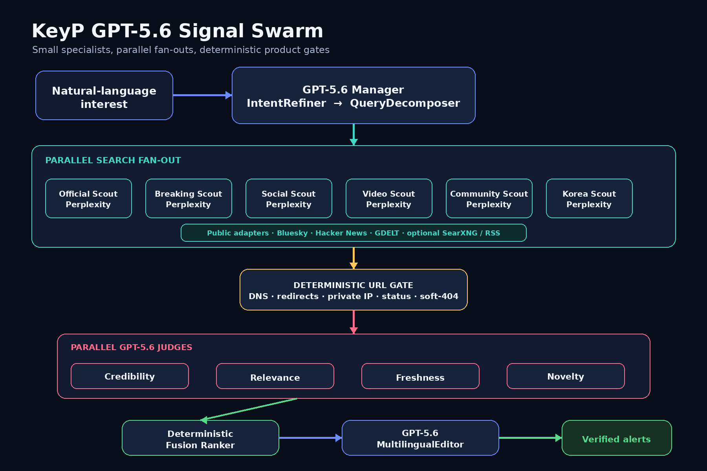
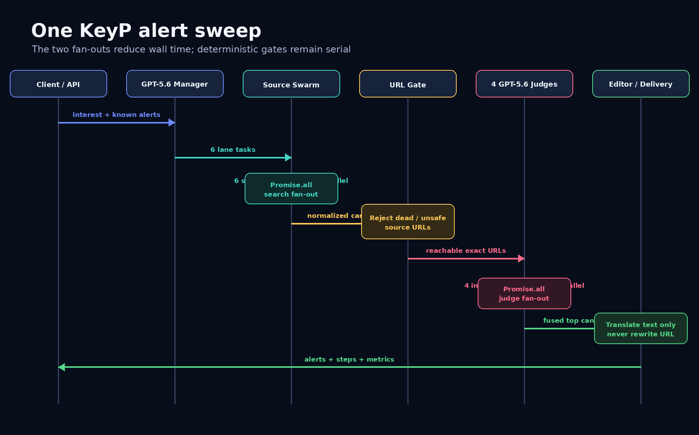

# Legacy Expo GPT-5.6 Signal Swarm

> Historical reference only. The current standalone submission app is documented in [`apps/keyp-web/docs/ARCHITECTURE.md`](../apps/keyp-web/docs/ARCHITECTURE.md) and does not use the Replit/Perplexity pipeline described below.

## Design goal

KeyP minimizes the amount of work assigned to any one model. Search lanes have narrow source contracts; judge agents see the same normalized candidate set but each decides only one dimension. Deterministic gates own security, freshness, deduplication, and final score fusion so prompt variation cannot bypass hard product rules.

## Execution sequence

## Components

| Stage              | Implementation                                                  | Responsibility                                                        | Failure behavior                |
| ------------------ | --------------------------------------------------------------- | --------------------------------------------------------------------- | ------------------------------- |
| IntentRefiner      | OpenAI Agents SDK + GPT-5.6                                     | Normalize goal, entities, locations, languages, exclusions, freshness | Deterministic intent            |
| QueryDecomposer    | OpenAI Agents SDK + GPT-5.6                                     | Produce exactly six bounded lane tasks                                | Six default tasks               |
| Source scouts      | Perplexity Sonar Pro via existing Replit OpenRouter integration | Search official, breaking, social, video, community, Korea sources    | Other lanes continue            |
| Public adapters    | Native HTTP/RSS adapters                                        | Bluesky, HN, GDELT, optional SearXNG/RSS                              | Adapter omitted or partial      |
| URL gate           | TypeScript                                                      | SSRF-safe DNS/redirect and dead/soft-404 rejection                    | Candidate rejected              |
| Four judges        | OpenAI Agents SDK + GPT-5.6                                     | Independently score credibility, relevance, freshness, novelty        | Deterministic dimension score   |
| Fusion ranker      | TypeScript                                                      | Weighted score and hard cutoffs                                       | Deterministic                   |
| MultilingualEditor | OpenAI Agents SDK + GPT-5.6                                     | Factual Korean/English alert copy                                     | Original-language copy          |
| Legacy fallback    | Existing KeyP pipeline                                          | Preserve service availability if the swarm cannot start               | Controlled by `KEYP_SWARM_MODE` |

## Parallelism

After planning, all six search scouts and all configured public adapters start together. After URL verification, all four judges start together. The response exposes:

- `wallClockMs`: observed end-to-end swarm duration.
- `sequentialEstimateMs`: sum of specialist durations plus serial stages.
- `parallelSpeedup`: sequential estimate divided by wall time.
- source and candidate coverage counts.

The metric is an operational estimate, not a benchmark claim. Network variance, rate limits, and model-provider queueing affect it.

## Deterministic invariants

1. A candidate must have an exact `http(s)` URL.
2. The URL cannot resolve to local, private, link-local, metadata, multicast, or reserved IP space.
3. Dead URLs, selected HTTP failures, redirect loops, and narrow soft-404 signatures are rejected.
4. An event older than `latestKnownEventAt` is rejected even if its page was published today.
5. Previously delivered stories and high-similarity candidates are rejected.
6. A judge exclusion, relevance below 45, or novelty below 45 is a hard rejection.
7. LLM output never controls source URLs or final weighted-score arithmetic.

## Model and gateway configuration

The Agents SDK uses `OpenAIProvider` with the Replit-injected `AI_INTEGRATIONS_OPENAI_BASE_URL` and `AI_INTEGRATIONS_OPENAI_API_KEY`. `useResponses: false` selects the OpenAI-compatible Chat Completions path exposed by the existing Replit integration. Sensitive tracing is disabled because the Replit gateway credential is not an OpenAI Platform tracing credential; KeyP emits privacy-minimized local run metrics instead.

Default models:

- Manager and judges: `gpt-5.6` (`KEYP_SWARM_MODEL` override)
- Search scouts: `perplexity/sonar-pro` (`KEYP_SEARCH_MODEL` override)
- Legacy fallback: the pre-existing KeyP OpenAI/OpenRouter/Anthropic path
